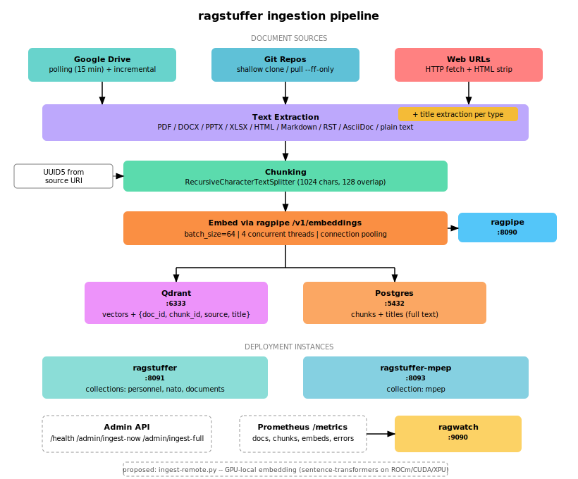

# Architecture

Document ingestion for RAG pipelines. Polls Google Drive, git repos, and web URLs, extracts text, chunks, embeds, and stuffs everything into Qdrant + Postgres for retrieval by [ragpipe](https://github.com/aclater/ragpipe).



## Data flow

```
Document sources (Google Drive / git / web)
        ↓ poll + download
Text extraction (PDF, DOCX, PPTX, XLSX, HTML, Markdown, plain text)
        ↓ title extraction per source type
Chunking (RecursiveCharacterTextSplitter, 1024 chars, 128 overlap)
        ↓
Embed via ragpipe /v1/embeddings (or sentence-transformers for ingest-remote.py)
        ↓
Upsert to Qdrant (vectors + {doc_id, chunk_id, source, title, created_at})
        ↓
Persist to Postgres (chunks + titles, keyed by deterministic UUID5 from source URI)
```

## Key design decisions

- **Deterministic UUID5 keys** from source URI — re-ingest is idempotent
- **Incremental updates** — only changed documents are re-downloaded
- **Title extraction per source type** — enables ragpipe to surface document titles in citations
- **Embedding delegated to ragpipe** (`/v1/embeddings`) in polling mode — no GPU needed for ingestion
- **`ingest-remote.py`** for bulk GPU-accelerated embedding (sentence-transformers with auto GPU detection)
- **Multiple collection support** via `QDRANT_COLLECTIONS` JSON env var
- **Collections registered** in `collections` table in Postgres

## Multiple collection support

ragstuffer can ingest into multiple Qdrant collections simultaneously. Collections are registered in the `collections` table in Postgres, and each source can target a specific collection via the `COLLECTION` environment variable.

| Environment variable | Description |
|---------------------|-------------|
| `QDRANT_COLLECTION` | Single collection name (backward compatible) |
| `QDRANT_COLLECTIONS` | JSON array of collection names for multi-collection ingest |

## Multiple instances

The same ragstuffer image can run as multiple instances with different collection configs. The deployment quadlets are managed in [framework-ai-stack](https://github.com/aclater/framework-ai-stack):

| Instance | Port | Collection | Quadlet |
|----------|------|------------|---------|
| ragstuffer | 8091 | personnel, nato, documents | `framework-ai-stack/quadlets/ragstuffer.container` |
| ragstuffer-mpep | 8093 | mpep | `framework-ai-stack/quadlets/ragstuffer-mpep.container` |

Both instances share the same Postgres database and GHCR image but write to different Qdrant collections. Each instance is configured via environment variables (`QDRANT_COLLECTION`, `RAGSTUFFER_ADMIN_PORT`, `GDRIVE_FOLDER_ID`).

## GPU auto-detection (ingest-remote.py)

Priority: CUDA (NVIDIA) > ROCm (AMD via HIP) > XPU (Intel) > CPU.

```python
import torch
if torch.cuda.is_available():
    device = "cuda"
elif torch.version.hip:
    device = "cuda"  # AMD ROCm uses CUDA device in sentence-transformers
elif torch.xpu.is_available():
    device = "xpu"
else:
    device = "cpu"
```

## Project structure

```
ragstuffer/
  common.py           — shared constants, text extraction, chunking, title extraction, HTML parsing
  docstore.py         — Postgres/SQLite backends + LRU-cached docstore wrapper
  ragstuffer/
    __init__.py      — package marker
    metrics.py        — Prometheus metrics definitions
  ragstuffer          — main poll loop, admin server, graceful shutdown (executable)
  ingest-remote.py    — one-shot GPU ingestion (sentence-transformers)
  setup.sh            — interactive setup wizard (SA key, folder ID, quadlet)
  deploy-remote.sh    — deploy ingest-remote.py to a GPU host via ssh
  quadlets/           — Podman quadlet for systemd integration
  Containerfile       — UBI10 CPU-only image
  Containerfile.rocm  — AMD ROCm GPU image
  Containerfile.cuda  — NVIDIA CUDA GPU image
```
